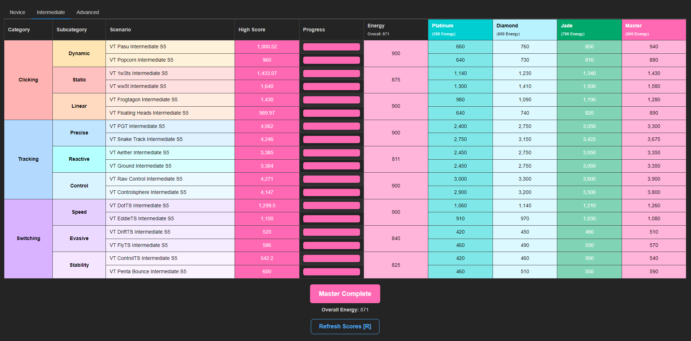

# Voltaic Season 5 Benchmark Tracker

A local benchmark tracker for Voltaic Season 5, that gets the scores directly from the game files, built with Tauri, using a React frontend. This is still work in progress and may have issues. The score requirements and scenario names are fetched from a gist, so changes do not require the app to be updated.

## Prerequisites

Make sure you have the following installed on your system if you want to build it:

- [Rust](https://www.rust-lang.org/tools/install)
- [Node.js](https://nodejs.org/)

## Installation

Install the dependencies:
```sh
npm install
```

## Running the Application

To start the application in development mode, run:
```sh
npx tauri dev

## Screenshot

